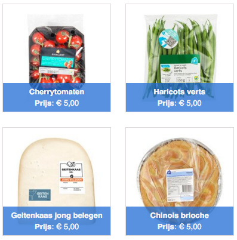
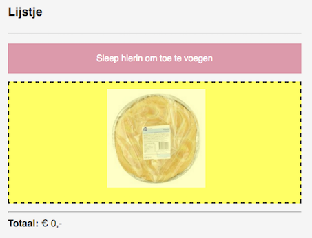
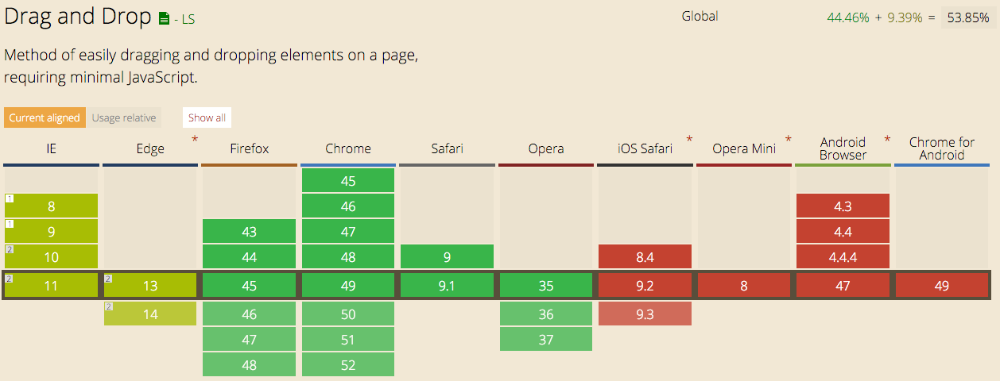

# Browser-Technologies

### Week 1 and 2

**Opdracht 2.1 - 1,2,3 Feature Detection**

* [Link](https://strexx.github.io/Browser-Technologies/week2/index.html)

### Week 3

* [Link](https://strexx.github.io/Browser-Technologies/week3/index.html)

### Feature: Drag and Drop

##### Use Case: 
I want a drag and drop shopping basket where I can drag items in with my mouse

For this assignment I've build a demo based on a usecase, following the principe of [Progressive Enhancement](https://en.wikipedia.org/wiki/Progressive_enhancement). The purpose of this assignment is to create an application in three layers (HTML, CSS and Javascript). In each of these layers the application has to work and has to be accessible for (all) end users. The first two layers should give the end user the idea of the understanding of the application and the third layer adds javascript functionalities. This is the most interesting part, because draganddrop is only supported with javascript. However, the core functionality of my app is to add items to a shopping cart. So my job during this assignment was to be creative and think of a practical solution.

**Core functionality**: 

Add clickable and functional buttons under the grocery items that adds up to the shopping basket. This should also work when tabbing through the application, for blind people using a screenreader.

**Enhanced functionality**: 

Add drag and drop functionality with javascript by first checking if the feature is available in the browser. If so, add functions to enhance to application.

 

### Browser support

### Accessibility issues

For this assignment I've build a demo based on a usecase, following the principe of progressive enhancement. Purpose of this assignment is to create your application in three layers. In each of this layers the application has to work and has to be accessible for (all) end users. The core functionality should work without CSS and Javascript. The second layer has to work with only CSS and the third layer adds javascript functionalities. This is the most interesting part, because draganddrop is only supported with javascript. However, the core functionality of my app is to add items to a shopping cart.
